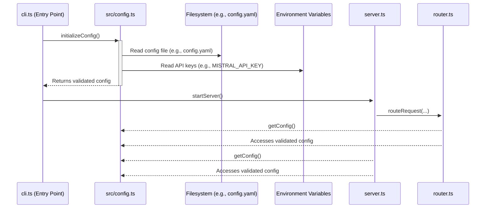

# Architecture Patterns: Dynamic Configuration

**Domain:** Application Configuration Management
**Researched:** 2024-07-29

## Recommended Architecture: Centralized Async Loader

To replace hardcoded objects, we will introduce a centralized, asynchronous configuration loader module (`src/config.ts`). This module will be initialized once at application startup, and its validated, type-safe output will be made available to the rest of the application via a singleton pattern.

This approach decouples configuration loading from business logic, improves maintainability, and provides a single source of truth for all configuration.

### Architectural Diagram



### Component Boundaries

| Component | Responsibility | Communicates With |
|---|---|---|
| `src/cli.ts` | **Application Entry Point.** Initializes configuration before starting any other process. | `src/config.ts`, `src/server.ts` |
| `src/config.ts` | **Single Source of Truth.** Loads config from files and environment. Validates against a schema. Merges sources. Exports an immutable, type-safe config object. | Filesystem, Environment Variables |
| `src/server.ts` | **API Server.** Handles HTTP requests. Imports config directly to get server settings and provider data. | `src/config.ts`, `src/router.ts` |
| `src/router.ts` | **Request Routing Logic.** Implements business logic for selecting a provider. Imports config directly. | `src/config.ts` |
| `config/default.yaml` | **Base Configuration.** Stores non-sensitive provider definitions and default settings. | `src/config.ts` (read-only) |

### Data Flow

1.  **Initialization:** The application starts via `src/cli.ts`.
2.  **Loading:** `cli.ts` calls and `await`s the `initializeConfig()` function from `src/config.ts`.
3.  **Parsing & Validation:** `config.ts` reads the base configuration from `config/default.yaml`, reads sensitive API keys from environment variables, merges them, and validates the final object against a Zod schema to ensure type safety.
4.  **Storage:** The validated, immutable config object is stored in a private variable within the `src/config.ts` module.
5.  **Server Start:** Once initialization is complete, `cli.ts` calls `startServer()`.
6.  **Access:** When a request arrives, modules like `server.ts` or `router.ts` call `getConfig()` to retrieve the configuration object and perform their duties. They no longer receive configuration via function parameters.

## Patterns to Follow

### Pattern 1: Singleton with Explicit Initialization

Create a dedicated module that manages the lifecycle of the configuration. It exposes an initialization function and a getter. This prevents the configuration from being in an uninitialized or invalid state.

**`src/config.ts`**
```typescript
import * as yaml from 'js-yaml';
import * as fs from 'fs';
import { z } from 'zod';

// 1. Define schema for validation (example)
const providerSchema = z.object({
  id: z.string(),
  name: z.string(),
  baseUrl: z.string().url(),
  // ... other provider properties
});

const configSchema = z.object({
  providers: z.array(providerSchema).min(1),
  server: z.object({
    port: z.number().default(8402),
  }),
});

type AppConfig = z.infer<typeof configSchema>;

// 2. Module-level variable to hold the initialized config
let appConfig: AppConfig;

// 3. Explicit, async initialization function
export async function initializeConfig(configPath: string = 'config/default.yaml'): Promise<void> {
  console.log('[Config] Initializing...');
  const fileContents = fs.readFileSync(configPath, 'utf8');
  const rawConfig = yaml.load(fileContents) as any;

  // Merge API keys from environment
  rawConfig.providers.forEach((p: any) => {
    const envKey = `${p.id.toUpperCase()}_API_KEY`;
    if (process.env[envKey]) {
      p.apiKey = process.env[envKey];
      p.enabled = true;
    } else {
      p.enabled = false;
    }
  });

  // Filter out disabled providers before validation
  rawConfig.providers = rawConfig.providers.filter((p: any) => p.enabled);

  try {
    appConfig = configSchema.parse(rawConfig);
    console.log(`[Config] Validation successful. Loaded ${appConfig.providers.length} providers.`);
  } catch (error) {
    if (error instanceof z.ZodError) {
      console.error('[Config] Configuration validation failed:', error.errors);
    }
    throw new Error('Failed to initialize configuration.');
  }
}

// 4. Getter function for safe access
export function getConfig(): AppConfig {
  if (!appConfig) {
    throw new Error('FATAL: Configuration has not been initialized. Call initializeConfig() first.');
  }
  return appConfig;
}
```

### Pattern 2: Centralized Startup Logic

The application entry point (`cli.ts`) should orchestrate the startup sequence: first config, then the server.

**`src/cli.ts` (Modified)**
```typescript
#!/usr/bin/env node

import { startServer } from './server.js';
import { initializeConfig } from './config.js';

async function main() {
  try {
    // 1. Initialize config before anything else
    await initializeConfig();

    // 2. Start the server
    const args = process.argv.slice(2);
    // ... arg parsing logic
    
    console.log('SimpleLLMRouter v1.0.0');
    console.log('Intelligent LLM routing for OpenClaw\n');
    
    await startServer();

  } catch (err) {
    console.error('Failed to start application:', err);
    process.exit(1);
  }
}

main();
```

### Pattern 3: Decoupled Consumption

Modules that need configuration import the `getConfig` function directly, removing the need for prop drilling.

**`src/server.ts` (Modified)**
```typescript
import { createServer } from 'node:http';
import { getConfig } from './config.js'; // Import the getter
// ... other imports

export async function startServer(): Promise<void> {
  const config = getConfig(); // Get the config
  const port = config.server.port;
  const providers = config.providers; // Access providers directly
  
  // ... server logic now uses 'providers' from the config object
}
```

## Anti-Patterns to Avoid

### Anti-Pattern 1: Top-Level `await` in Module Scope

**What:** Performing asynchronous operations (like reading a file) in the global scope of a module and exporting the result.

**Why bad:** It creates hard-to-debug side effects on import. The timing of when the async operation completes is not guaranteed relative to other module imports, leading to race conditions.

**Instead:** Use an explicit `initializeConfig()` function that is called once at the application's entry point.

### Anti-Pattern 2: Global Mutable Singleton

**What:** Exporting a mutable configuration object that can be modified by any part of the application.

**Why bad:** It makes state unpredictable. If one module modifies the config, it can cause unexpected behavior in another. Debugging becomes a nightmare.

**Instead:** The `getConfig()` function should return an immutable or deeply frozen object. The configuration should be set once at startup and treated as read-only thereafter.

## Build Order & Integration Plan

1.  **Create `config/default.yaml`:** Move the `PROVIDER_DEFINITIONS` from `src/providers.ts` into a new YAML file.
2.  **Implement `src/config.ts`:** Create the new configuration module with schema validation (`zod`), loading logic, and the `initializeConfig`/`getConfig` exports.
3.  **Refactor `src/cli.ts`:** Modify the entry point to be an `async` function that `await`s `initializeConfig()` before calling `startServer`.
4.  **Refactor `src/server.ts`:** Remove the `loadAllProviders` call. Remove the `providers` parameter from internal functions. Use `getConfig()` to access provider and server configuration.
5.  **Refactor `src/router.ts`:** Remove the `providers` parameter from `routeRequest`. Use `getConfig()` to access the list of available providers.
6.  **Cleanup `src/providers.ts`:** Remove `PROVIDER_DEFINITIONS`, `loadProviderConfig`, `loadAllProviders`, and `buildProvider`. The remaining utility functions (like `getModel`) should be adapted to use the config from `getConfig()`.

This phased approach ensures a smooth transition from the hardcoded, prop-drilled architecture to a centralized, type-safe configuration model.
