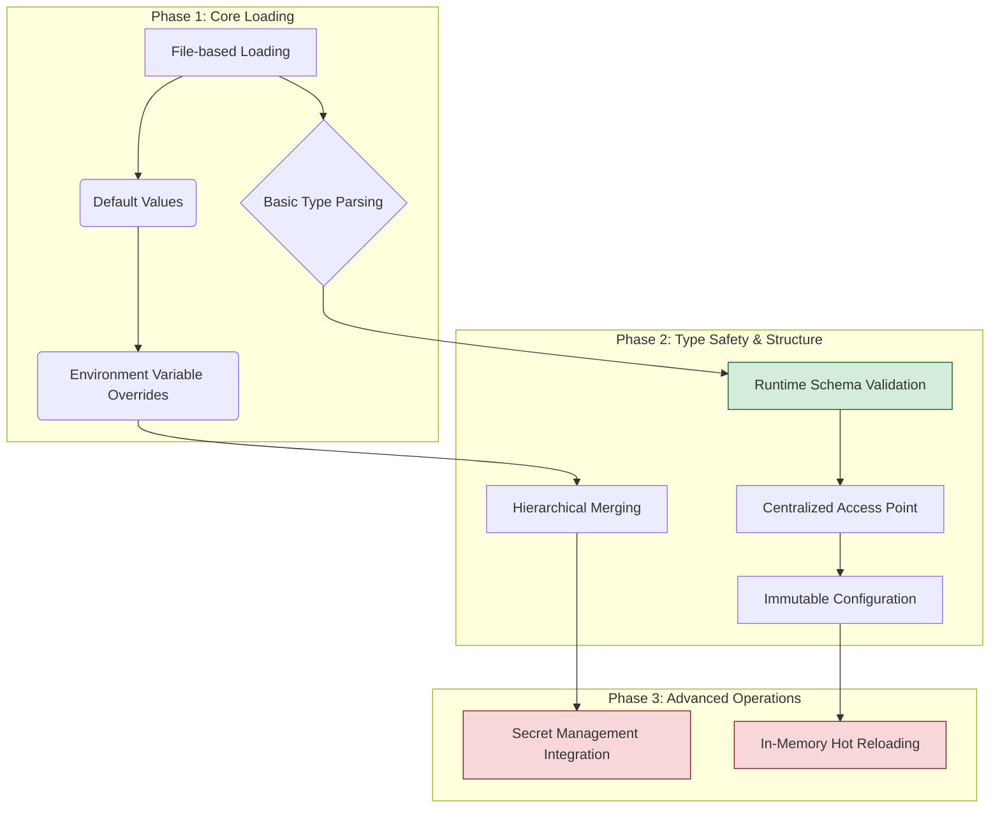

# Feature Landscape: Type-Safe External Configuration

**Domain:** TypeScript/Node.js Configuration Management
**Researched:** 2024-07-25

This document outlines the features for a type-safe, external configuration system, categorizing them to inform the project's requirements and implementation phases.

## Table Stakes

These are foundational features that any modern configuration system is expected to have. Missing these would make the system feel incomplete and difficult to use in a standard cloud-native development workflow.

| Feature | Why Expected | Complexity | Notes |
|---------|--------------|------------|-------|
| **File-based Loading** | The core requirement is to externalize config from code. JSON and YAML are the most common formats. | Low | Must support at least one of JSON or YAML. |
| **Environment Variable Overrides** | A 12-Factor App principle. Allows environment-specific settings (e.g., DB hosts, ports) without changing files. | Low | The system should automatically replace a value from a file with one from `process.env` if it exists. |
| **Default Values** | Provides a fallback mechanism, ensuring the application can run out-of-the-box in a development environment. | Low | The system should define a base configuration that is merged with other sources. |
| **Support for Multiple Environments** | Developers expect to manage `development`, `staging`, and `production` configurations. | Low | Typically handled by loading files based on the `NODE_ENV` variable (e.g., `production.yaml`). |
| **Basic Type Parsing** | The library should correctly parse primitive types like strings, numbers, and booleans from files. | Low | For example, `"true"` becomes `true` (boolean), `"42"` becomes `42` (number). |
| **Centralized Access Point** | The application should import and use a single, consistent configuration object or service. | Low | Avoids scattered `process.env` access and ensures consistency. |

## Differentiators

These features provide significant improvements in reliability, developer experience, and operational flexibility. They separate a basic config loader from a robust, production-grade system.

| Feature | Value Proposition | Complexity | Notes |
|---------|-------------------|------------|-------|
| **Runtime Schema Validation** | **CRITICAL for Type Safety.** Guarantees at application startup that the loaded configuration (from all sources) matches a defined schema. Prevents runtime errors from typos or incorrect types. | Medium | The modern standard is to use a library like **Zod** to define the schema. The config is parsed against the schema, and a typed object is inferred automatically. |
| **Immutable Configuration** | Exposing the loaded configuration as an immutable object (`Readonly<T>`) prevents accidental modification at runtime, which is a common source of bugs. | Low | Can be implemented using `Object.freeze()` after the configuration is loaded and validated. |
| **In-Memory Hot Reloading** | Allows the configuration to be updated without restarting the application process. Essential for zero-downtime systems and dynamic feature flagging. | High | Requires a file watcher (e.g., `chokidar`) and logic to safely update the config object and notify relevant parts of the application. Not to be confused with `nodemon`, which restarts the entire process. |
| **Secret Management Integration** | Avoids storing secrets in config files. The system can fetch sensitive values from a vault (e.g., AWS Secrets Manager, HashiCorp Vault) during startup. | High | Involves adding an async initialization step and integrating with cloud provider SDKs. The config could use a special syntax like `arn:aws:secretsmanager:...` to denote a secret. |
| **Format Extensibility** | Support for additional formats like TOML or `.env` files. | Medium | Increases flexibility but adds parsing dependencies. `.env` support is very common. |
| **Hierarchical Merging Strategy** | Defines a clear order of precedence for multiple configuration sources (e.g., defaults < file < environment variables < command-line args). | Medium | Most established libraries (`config`, `convict`) provide this as a core feature. |

## Anti-Features

These are patterns or "features" that should be actively avoided. They are common in naive implementations and lead to brittle, insecure, and hard-to-maintain systems.

| Anti-Feature | Why Avoid | What to Do Instead |
|--------------|-----------|-------------------|
| **Mutable Global Config** | Allowing any part of the application to modify the configuration object at runtime leads to unpredictable behavior and makes debugging nearly impossible. | Expose the configuration as an immutable or readonly object. Provide a controlled hot-reloading mechanism if dynamic changes are needed. |
| **Type Assertion Without Validation** | Using `as MyConfigType` on a loaded JSON object. This provides zero runtime safety and is the primary cause of `TypeError: Cannot read properties of undefined`. | Use a schema validation library (like Zod) to parse the configuration. The type should be inferred from the schema, not asserted. |
| **Committing Secrets to Git** | Placing API keys, database credentials, or other secrets in `config.json` or `.env` files that are committed to version control is a major security vulnerability. | Load secrets from environment variables or a dedicated secrets management service. Commit a `template.env` or `config.example.json` file with placeholder values. |
| **Scattered `process.env` Access** | Accessing environment variables directly (`process.env.MY_VAR`) all over the codebase makes the configuration untyped, hard to track, and difficult to validate. | Funnel all configuration, including environment variables, through a single, validated configuration module. |
| **Blocking the Event Loop for Secrets** | Making synchronous calls to external services (like a secret vault) during module initialization can block the Node.js event loop and severely impact startup performance. | Configuration initialization that involves I/O should be asynchronous. Provide an async `getConfig()` function or initialize it at the application's entry point before starting the server. |

## Feature Dependencies

Understanding the dependencies between features is crucial for phased implementation.

*   **Core:** Basic loading and merging are prerequisites for anything else.
*   **Type Safety:** Runtime validation (`F`) is the most critical feature for achieving the project's goal. It depends on having a parsed object to validate.
*   **Advanced:** Secret management and hot-reloading are complex features that build upon a stable, validated, and structured configuration system.

## Sources

- [General Best Practices for TypeScript Config (2024)](https://vertexaisearch.cloud.google.com/grounding-api-redirect/AUZIYQHvqNx_E5g8MYzVMxON5dhWyoxjFtyKaF_VZVUHcjNFg_19Og6psBbWHY5rvhgOCaJ646pDV5SvI8z6IWFetCissmzl2WyFhaU8UBdHltBWH9enjY4jKnWd9vIMPMtSjLKIrtgcjIPJNz_wOMaCWaW0Rs7YFV3AnTx5-2v7Q-qeA2sw-i07oITQlcJB_WJK8lP9e-dB_9wamyrFdP4)
- [node-config library documentation](https://github.com/node-config/node-config)
- [convict library documentation](https://github.com/mozilla/node-convict)
- [Discussion on Zod for config validation](https://geekflare.com/zod-tutorial-examples/)
- [Hot Reloading approaches in Node.js](https://oneuptime.com/blog/hot-reload-nodejs)
